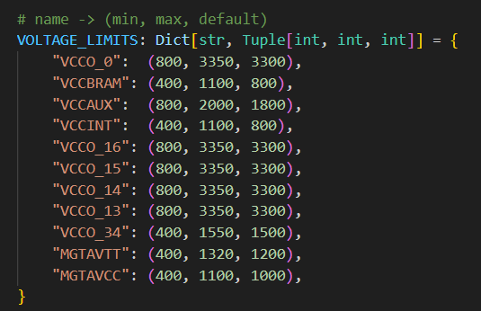

# 一、执行模式

## 1.1 交互模式

```json
python main_shell.py
```

## 1.2 单命令模式

```json
python main_shell.py -c "vccm --file C:/Users/DELL/Desktop/test_workspace/shell/bram_36e1_2_wf_0_a.rbt --vccm_values 105"
```

## 1.3 脚本模式

```json
python main_shell.py myscript.txt
```

# 二、常用命令

## 2.1 基础功能
### 2.1.1压缩位流
base --file 文件路径 --device MC1P110 --COMPRESS

- device
  - MC1P110
  - MC1P170
  - MC1P210

## 2.2 VCCM

```shell
vccm电压值支持多个电压值，多个电压值时用','隔开，目前支持：
105
106
107
108
109
110
111
112
115
vswl只支持传入一个电压值,目前支持：
1075
1100
1125
1150
1175
1200
1225
1250
1275
1300
1325
1350
1375
1400
1425
1450
1475
1500
```

### 2.2.1 处理单个文件或单个路径

```shell
vccm --file rbt文件路径/bit文件路径/文件路径 --vccm_values vccm电压值 --vswl_selected vswl电压值
传入单个文件：处理结果保存在所在文件夹的对应电压文件夹下
传入一个路径：处理结果保存在路径下的对应电压文件夹下
```

### 2.2.2 处理项目

```shell
vccm --project 项目路径 --vccm_values vccm电压值 --vswl_selected vswl电压值

这里项目的意思是，对这个项目路径下每个文件夹单独处理，将结果生成到每个文件夹下。
```

## 2.3 电压、时钟配置

- 端口号
  - --port COM4
  - 端口号可在设备管理器的 ”端口“ 中查看；
  - 每次进行串口相关操作时，都需要指定串口号，如果执行过程中串口已连接，不会重复连接。如果串口未连接，会默认进行重连；
- 发送时钟配置
  - `serial --port COM4 --clock_config_path "D:\a\b\c.txt"`
  - path必须被双引号包裹；
  - 路径中的斜线可以是`'/'`、`'\'`、`'\\'`；
- 显示电压
  - serial --port COM4 --voltage_show
  - 格式如下：

```
[CLISerialHandler Info] voltage is {'VCCO_0': '2620', 'VCCBRAM': '0900', 'VCCAUX': '1800', 'VCCINT': '0800', 'VCCO_16': '3300', 'VCCO_15': '3300', 'VCCO_14': '3300', 'VCCO_13': '3300', 'VCCO_34': '1500', 'MGTAVTT': '1200', 'MGTAVCC': '1000', 'VCCADC': '1', 'VCCREF': '0'}
```

- 配置电压
  - `serial --port COM4 --voltage_set 2620 0900 1800 0800 3300 3300 3300 3300 1500 1200 1000 1 0`
  - 前11路严格限制元素长度，每个元素长度为4，后面两路长度为1
  - 按照显示电压中的顺序进行电压配置，全部是整数，范围如下图：



## 2.4 Vivado相关功能


vivado路径：

```
E:\Application_Vivado\Vivado\2020.1\bin

C:/Users/DELL/Desktop/test_workspace/CLI_test/example.rbt
```


## 2.5 vivado的tcl集成

修改与添加文件如下：
命令行：CLI/cli_vivado.py
统一入口：CLI/main_shell.py
核心run_vivado_tcl（集成烧写bit、bin、mcs，回读，执行自定义的vivado tcl脚本）：CORE/run_vivado_tcl.py
测试demo脚本：RESOURCE/SCRIPTS/demo_test/test_vivado_api.txt

```python
python main_shell.py test_vivado_api.txt
```

### 2.5.1 核心命令

| 命令              | 功能        | 示例                                                         |
| ----------------- | ----------- | ------------------------------------------------------------ |
| `vivado_program`  | 烧写到FPGA  | `vivado_program -v $VIVADO_PATH -b design.bit`               |
| `vivado_flash`    | 烧写到Flash | `vivado_flash -v $VIVADO_PATH -b design.mcs -f mt25ql128-spi-x1_x2_x4` |
| `vivado_readback` | 从FPGA回读  | `vivado_readback -v $VIVADO_PATH -o readback.rbd`            |
| `vivado_custom`   | 执行TCL脚本 | `vivado_custom -v $VIVADO_PATH -t script.tcl`                |
| `vivado_test`     | 测试功能    | `vivado_test -v $VIVADO_PATH`                                |
| `vivado_help`     | 显示帮助    | `vivado_help`                                                |
| `vivado_quick`    | 快速操作    | `vivado_quick test $VIVADO_PATH`                             |


# 三、开发规范

## 3.1 项目结构

项目整体分成GUI、CORE、CLI、RESOURCE四个部分

- GUI
  - 项目UI部分
  - COMPONENT
    - 自定义组件
  - PAGES
    - 每个标签页
- CORE
  - 主要功能，为GUI和shell提供api
  - 名称严格按照module_xx
- CLI
  - 各模块命令行参数解析文件；
  - 入口统一为main_shell.py。